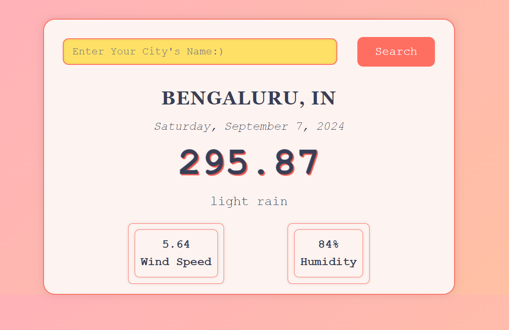

# React + Vite

This template provides a minimal setup to get React working in Vite with HMR and some ESLint rules.

Currently, two official plugins are available:

- [@vitejs/plugin-react](https://github.com/vitejs/vite-plugin-react/blob/main/packages/plugin-react/README.md) uses [Babel](https://babeljs.io/) for Fast Refresh
- [@vitejs/plugin-react-swc](https://github.com/vitejs/vite-plugin-react-swc) uses [SWC](https://swc.rs/) for Fast Refresh

## This weather app showcases a city's temperature, wind speed, and humidity. It is a Retro-Themed Weather App built using HTML, CSS, and JavaScript. The app uses a weather API to fetch real-time weather data based on the user's input city and displays it with a retro-inspired UI design.

### Type 'npm run start' in the terminal to get the Follow Link to the web app.

# Component Structure
This project is built using a single-page approach. The key components are:

 HTML Structure: 

The primary structure of the page is managed in the index.html file.
Elements like the search bar, weather display, and result sections are all in this file.
CSS Styling:

The retro styling is defined in the styles.css file.
It contains classes for elements like .App, .temp, .search-engine, etc., providing layout, design, and animations.
JavaScript Functionality:

Weather Fetching:
The core functionality lies in index.js, where the API request is made to OpenWeatherMap.
The weather data is fetched and displayed based on the user’s input city.
DOM Manipulation:
JavaScript dynamically updates weather information such as temperature, weather description, wind speed, and humidity based on the API response.
Error handling is also present for invalid inputs.
Important Files:
index.html: The base structure of the app.
styles.css: Retro-inspired UI design and animations.
index.js: Manages API calls and updates the UI with weather data.

# State Management
This project follows a simple state management pattern using vanilla JavaScript.

State Variables:

The app doesn't use frameworks like React or Vue, so the state is managed using regular JavaScript variables.
When a user searches for a city, the weather data is fetched and stored in variables (e.g., temperature, humidity, etc.).
Rendering:

The DOM is updated dynamically based on the response received from the API.
The values of these variables are injected directly into the HTML using innerHTML and textContent methods.
Flow:
The user enters a city name in the search bar and clicks the "Search" button.
JavaScript fetches the weather data for the entered city using the OpenWeatherMap API.
If the response is successful, it updates the displayed data such as temperature, weather conditions, wind speed, and humidity.
If an error occurs (e.g., invalid city name), the error message is displayed to the user.

## This app uses the OpenWeatherMap API to fetch real-time weather information.
